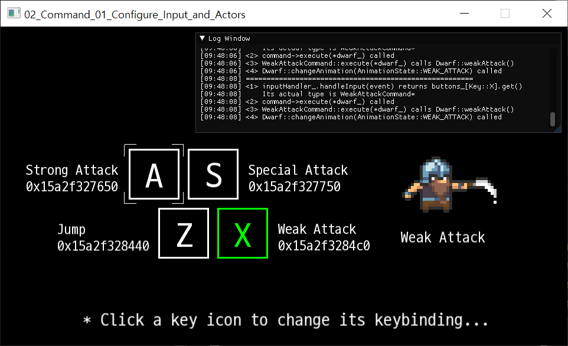

# Interactive Game Programming Patterns


Examples from https://gameprogrammingpatterns.com as interactive GUI demo

### *Just started! There's only one example available now; More to come!*



This project aims to provide running demos
made out of the snippets from the famous design pattern book by Robert Nystrom,
called [Game Programming Patterns](https://gameprogrammingpatterns.com) (abbreviated as *GPP* from now).

Each folder consists of a demo for the design pattern introduced in each chapter of the book.


## Motivation
While the example snippets from the GPP book is good enough to demonstrate the patterns, they are still snippets;\
You cannot run them as they are.

The author provides the [demo source](https://github.com/munificent/game-programming-patterns/tree/master/code/cpp), but it runs on the *boring command line*.\
That is why I started this project; **To write interactive GUI demo to extend the examples, complementing the GPP.**

### So, is it a full game?
Unfortunately, it is not; It is more like a small *interactive learning material*.

As I already mentioned above, this project aims to complement the book.\
Writing a full game is not only a huge work, but also beyond the scope of a learning material for the book.

### Why SFML?
SFML is one of the easiest multimedia library to accomplish the given task: writing a small demo.\
I considered [SDL](https://www.libsdl.org/) too, but it is a C library, so it is not very friendly to use with *object-oriented* fashion.

### I see you used smart pointers...
Right. The original snippets from the book only uses *raw pointers*, [for the readers who use languages other than C++.](http://gameprogrammingpatterns.com/introduction.html#about-the-sample-code)\
But, for the real running demo written in C++, I think it is a good idea to clearly show the ownerships of each variable by using smart pointers.

Also, it's been literally a decade when `C++11` introduced smart pointers;\
Learning to use smart pointers to manage ownership is necessary in modern C++, as it is quite common these days.

So, please go learn them; It is not that difficult concept to understand.


## How to study the source
Each `Patterns/{xx-Pattern}/{yy-Example}/src` folder contains the source files.

Start examining the lines commented as **`// Snippet from the book`**.\
Also check the callers who call **`global::logger->AddLog(...)`** function.


## Build
You need to install these along with your favorite [C++ compiler that supports **C++17 or later**](https://en.cppreference.com/w/cpp/compiler_support).
1. [**CMake**](https://cmake.org/), a meta build system for C/C++.
2. [**Ninja**](https://ninja-build.org/), a small build system with a focus on speed.
3. [**vcpkg**](https://vcpkg.io/), the C/C++ library manager by Microsoft.
> TEMPORARY NOTE: vcpkg port of `ImGui-SFML v2.4` is having include failure issues right now, you should `git checkout a506c84` on vcpkg to use `v2.3` before the issue is fixed.

Next, add `VCPKG_ROOT` environment variable pointing to the directory where vcpkg is installed.

Finally, when executing `cmake`, specify the cmake preset as shown below.
```bash
cd /path/to/interactive-game-programming-patterns
cmake --preset ninja-vcpkg
cmake --build --preset ninja-vcpkg-debug
```

> If you are using Visual Studio 2019 or later, you can just open the project's folder, wait for the CMake to automatically configure presets, and hit F6 to build.\
> You still need to add `VCPKG_ROOT` environment variable though.

Since this project uses vcpkg's [Manifest Mode](https://vcpkg.io/en/docs/users/manifests.html), the dependencies are automatically installed.\
But if you're on Linux, you have to install some dependencies manually from the package manager.
```bash
# On Ubuntu
sudo apt install libx11-dev libxrandr-dev libxi-dev libudev-dev libgl1-mesa-dev -y
```


## Dependencies

This project relies on these libraries:
+ [**SFML**](https://www.sfml-dev.org/) [(GitHub link)](https://github.com/SFML/SFML) : Simple and Fast Multimedia Library
    - License: [zlib/libpng](https://www.sfml-dev.org/license.php)
+ [**Dear ImGui**](https://github.com/ocornut/imgui) : Bloat-free Graphical User interface for C++ with minimal dependencies
    - License: [MIT/Expat](https://github.com/ocornut/imgui/blob/master/LICENSE.txt)
+ [**ImGui-SFML**](https://github.com/eliasdaler/imgui-sfml) : Dear ImGui binding for use with SFML
    - License: [MIT/Expat](https://github.com/eliasdaler/imgui-sfml/blob/master/LICENSE)


## License

### Source code
The source code of this project is licensed under the [MIT/Expat license](LICENSE).

There are some exceptions, which is some source files copy-pasted from other repos.\
On top of those source files, there are some license notifications and links to the original repos.

### Assets
You can find the license of each asset on `Patterns/{xx-Pattern}/{yy-Example}/assets`, with the asset itself.
